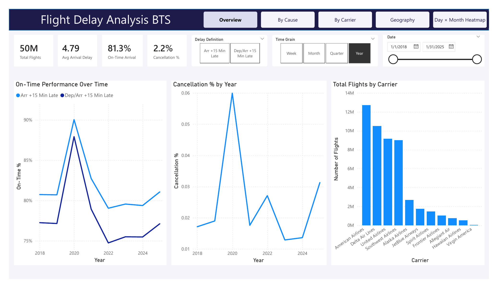

# Flight Delay Analysis — Data Engineering Pipeline

I took **~49.7 million rows** of raw U.S. flight records (Bureau of
Transportation Statistics, Jan 2018 – Jan 2025) and built a batch pipeline that
turns them into one clean, analytics-ready table behind a Power BI dashboard
answering a simple question: *why are flights late?*

I built it to show how I'd engineer this, not just chart it. The pipeline is a
reproducible medallion flow, everything is stored columnar in Parquet, the
transformations are SQL that would move to a warehouse unchanged, and I
independently recompute every dashboard number in SQL to make sure the DAX is
right. The whole thing runs end-to-end on a laptop for **$0**. Further down I'm
honest about where that stops being the right call and what I'd change to run it
in production.



> Overview page of the Power BI dashboard built on the pipeline's gold table.
> Full export: [`reports/PowerBI_Dashboard_Export.pdf`](reports/PowerBI_Dashboard_Export.pdf).

---

## Architecture

A **medallion architecture** (bronze → silver → gold), each layer an
independently re-runnable stage. [DuckDB](https://duckdb.org) is the compute
engine throughout; [Parquet](https://parquet.apache.org) (ZSTD) is the storage
format between layers.

```
   data/raw/                 CSV, one file per month  (external — from BTS)
       │   01_ingest_raw_to_bronze.py     project columns, CSV → Parquet
       ▼
   data/bronze/              typed Parquet, 1:1 with source
       │   02_clean_bronze_to_silver.py   null-profile, dedupe, lowercase cols
       ▼
   data/silver/              cleaned monthly Parquet
       │   03_enrich_silver_to_gold.py    union all months + enrich codes→labels
       ▼
   data/gold/                one analytics-ready table  ──►  Power BI dashboard
       │   04_validate_gold_kpis.py       recompute KPIs in SQL (QA gate)
       ▼
   verified metrics
```

| Stage | Script | In → Out | What it does |
|-------|--------|----------|--------------|
| 1 · Ingest | `pipeline/01_ingest_raw_to_bronze.py` | `raw/*.csv` → `bronze/` | Projects the ~30 relevant columns from the ~110-column BTS schema; lands each month as ZSTD Parquet via a streaming `COPY` — no full in-memory materialization. |
| 2 · Clean | `pipeline/02_clean_bronze_to_silver.py` | `bronze/` → `silver/` | Profiles null rates across all files (writes `docs/null_profile.png`), then `SELECT DISTINCT` to dedupe and lower-cases every column for case-stable downstream SQL. |
| 3 · Enrich | `pipeline/03_enrich_silver_to_gold.py` | `silver/` → `gold/` | Unions every month into one table and decodes dimensions (`AA` → American Airlines, cancellation `B` → Weather) so the BI layer needs no joins. |
| 4 · Validate | `pipeline/04_validate_gold_kpis.py` | `gold/` → stdout | Recomputes the headline KPIs in SQL and diffs them against the Power BI cards — catches DAX misconfiguration before the dashboard is trusted. |

Paths are centralized in `pipeline/config.py` and overridable by environment
variable, so the same code runs against a local `data/` folder, a CI runner, or
a mounted object-store bucket.

---

## Why DuckDB

DuckDB is an **in-process, columnar OLAP engine** — think "SQLite for
analytics." For this project it's the right tool for concrete reasons:

- **Zero infrastructure.** No server, no cluster, no credentials. `pip install
  duckdb` and the whole 50M-row pipeline runs on a laptop. Anyone who clones the
  repo can reproduce it.
- **Reads Parquet/CSV natively and fast.** Vectorized execution + predicate/
  projection pushdown mean stage 1 streams CSV straight to Parquet and later
  stages scan only the columns they touch.
- **Larger-than-memory.** It spills to disk, so 50M rows aggregate fine on a
  machine that couldn't hold them all in RAM — no need to hand-batch.
- **SQL-first and portable.** The transformations are plain SQL. The same
  `CASE` enrichment and `COUNT(*) FILTER (...)` KPI logic moves to Snowflake,
  BigQuery, or Spark SQL with minimal change — DuckDB is a stepping stone, not a
  dead end.
- **Compact.** ZSTD Parquet keeps every layer small enough to iterate on
  quickly.

**The benefit here specifically:** the dataset is ~50M rows / single-digit GB
compressed — it fits comfortably on one machine. Reaching for Spark or a cloud
warehouse would add cost, latency, and operational overhead with **no payoff at
this scale**. DuckDB gives sub-second-to-seconds query latency with no cluster
spin-up, which is exactly what you want while iterating on transformations and
validating KPIs.

---

## Design decisions & trade-offs

Every choice buys something and costs something. The honest version:

- **DuckDB (embedded, single-node)** → dead simple and fast for a
  one-machine dataset. **Cost:** single-node only — no multi-user concurrency,
  no streaming, no horizontal scale. The moment this data is 50× bigger or
  needs concurrent writers, DuckDB is the wrong tool.
- **Parquet over CSV between layers** → columnar compression, schema, and
  pushdown. **Cost:** not human-readable; you need a reader to inspect it.
- **Medallion (bronze/silver/gold)** → each stage independently rebuildable and
  debuggable; a logic change rebuilds gold from silver in seconds. **Cost:**
  ~3× the storage of transforming in place — cheap, and worth it.
- **`SELECT DISTINCT` for dedupe** → one line, no key management. **Cost:** a
  full scan/sort and it can't distinguish "legitimately identical rows" from
  true duplicates. In production I'd dedupe on a business key with a
  deterministic tie-break.
- **Full rebuild each run** (not incremental) → simple and idempotent; the whole
  history reprocesses in minutes. **Cost:** wasteful once the archive is large —
  production would load incrementally by month.
- **Power BI import mode** over a compact gold Parquet → fast, snappy visuals.
  **Cost:** a static snapshot; refresh means re-import. DirectQuery would be live
  but slower.
- **Independent SQL KPI check** instead of trusting DAX → catches filter-context
  and null-handling bugs. **Cost:** it's a manual eyeball step, not an automated
  gate (see below).

---

## How this would differ in production

This repo is intentionally a **local, single-node build**. At real scale or on a
team, the shape changes:

| Concern | This project | Production |
|---------|--------------|------------|
| Compute | DuckDB on a laptop | Warehouse (Snowflake/BigQuery/Databricks) or Spark for true distributed scale |
| Transformations | Python + inline SQL | **dbt** models — versioned, tested, documented, with lineage |
| Orchestration | run 4 scripts by hand, in order | **Airflow / Dagster / Prefect** — scheduled, retried, alerted, backfillable |
| Loading | full rebuild every run | **incremental & idempotent** — partition by month, `MERGE` on keys |
| Storage | local `data/` folder | object store (S3/GCS) with **Iceberg/Delta** for ACID + time travel |
| Data quality | manual `04_validate_kpis.py` | **dbt tests / Great Expectations** as CI gates that fail the build |
| BI | static import from Parquet | DirectQuery / a semantic layer on the warehouse |
| Ops | none | CI/CD, monitoring, schema-contract enforcement, data-freshness SLAs |

The key point: **DuckDB isn't a downgrade from that — it's the correct choice
for this scale**, and because the logic is SQL and Parquet, migrating it into
the production stack above is a port, not a rewrite.

---

## Dataset

**Reporting Carrier On-Time Performance (1987–present)** from the U.S. Bureau of
Transportation Statistics (BTS / TranStats). Monthly CSVs, Jan 2018 – Jan 2025,
~49.7M rows after cleaning. Not committed (large, and freely re-downloadable) —
see [`data/README.md`](data/README.md) for how to fetch it into `data/raw/`.

---

## Results (headline KPIs)

Computed over the full ~49.7M-row gold table and cross-checked against the
Power BI dashboard:

| Metric | Value |
|--------|-------|
| Total flights | ~49.7M |
| Avg arrival delay | 4.79 min (includes early arrivals as negative) |
| On-time arrival rate | ~81.3% (arrived within 15 min) |
| Cancellation rate | 2.2% |

Delays are broken down by **cause** (carrier, weather, NAS, security, late
aircraft), by **carrier**, and over **time** in the dashboard. Full analysis and
findings: [`reports/Flight_Delay_Analysis_Report.pdf`](reports/Flight_Delay_Analysis_Report.pdf).

---

## Repository layout

```
flight-delay-de-pipeline/
├── pipeline/                          # the ELT stages, run in order
│   ├── config.py                      # centralized, env-overridable paths
│   ├── 01_ingest_raw_to_bronze.py
│   ├── 02_clean_bronze_to_silver.py
│   ├── 03_enrich_silver_to_gold.py
│   └── 04_validate_gold_kpis.py
├── data/                              # medallion lakehouse (gitignored contents)
│   ├── bronze/  ·  silver/  ·  gold/
│   └── README.md                      # layer definitions + how to get source data
├── docs/                              # dashboard preview + null-profile chart
└── reports/                           # written report (PDF/DOCX) + Power BI export
```

---

## Running it

```bash
python3 -m venv .venv && source .venv/bin/activate
pip install -r requirements.txt

# 1. download BTS monthly CSVs into data/raw/  (see data/README.md)

# 2. run the pipeline, in order
python pipeline/01_ingest_raw_to_bronze.py     # raw    → bronze
python pipeline/02_clean_bronze_to_silver.py   # bronze → silver  (+ null_profile.png)
python pipeline/03_enrich_silver_to_gold.py    # silver → gold
python pipeline/04_validate_gold_kpis.py       # QA gate: recompute KPIs

# 3. point Power BI at data/gold/flights_combined.parquet
```

Each stage is idempotent — safe to re-run — and skips with a clear message if
its input layer is empty.

## License

MIT — see [LICENSE](LICENSE).
